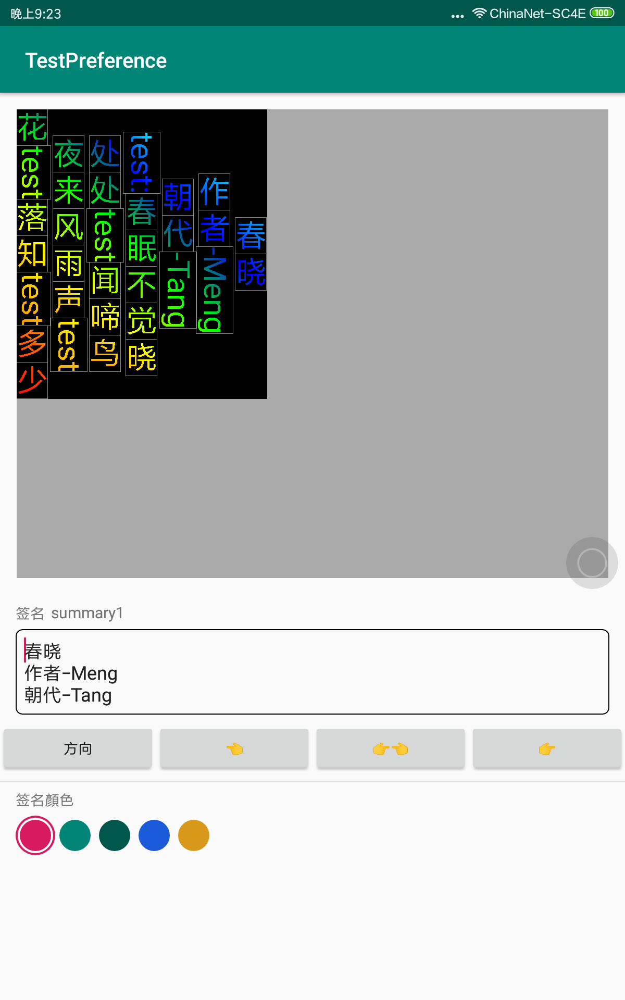

# 能够竖排和横排显示的控件

1. 增加颜色渐变
2. 设置了文本显示边框，去掉设置DEBUG=false
3. 修改了文本区域大小不正确的问题
4. 修改了居中，居右不正确的问题
5. 修改竖排中英文混合显示中英文对齐方式，目前竖中心线对齐，底线对齐可以注释掉marginFixed = (float) ((mVerticalwordHeight - mChineseWordWdth) *0.5);，使marginFixed 恒为 0；
6. 修改了文本区域宽或高会超过外部layout布局的错误
7. 行间距默认为0，如果需要修改请自行设置mSpacing

# 可用的方法

1. 设置颜色渐变public void setLinearGradientColor(int[] color, int angle) ；
2. 设置字符串public void setText(String text) ；
3. 设置对齐方式public void setGravity(int mGravity) ；
4. 设置横向还是纵向显示public void setHorizontal(boolean orientation) ；
5. 查看是否横向public boolean isHorizontal()；
6. 更新public void update()；

# 注意
1. 由于是自定义View，TextView'的属性在这里不管用
2. 只有3个方法可用
**设置显示的字符串**，
    public void setText(String text) ；
**设置对齐方式**
  Gravity.START
  Gravity.CENTER 
 Gravity.END
 public void setGravity(int gravity) ；
**设置是否垂直显示**
    public void setHorizontal(boolean orientation) ；
3. 支持warp_content属性
4. 支持中英文混合显示（英文旋转，中文不旋转）

# 预览

